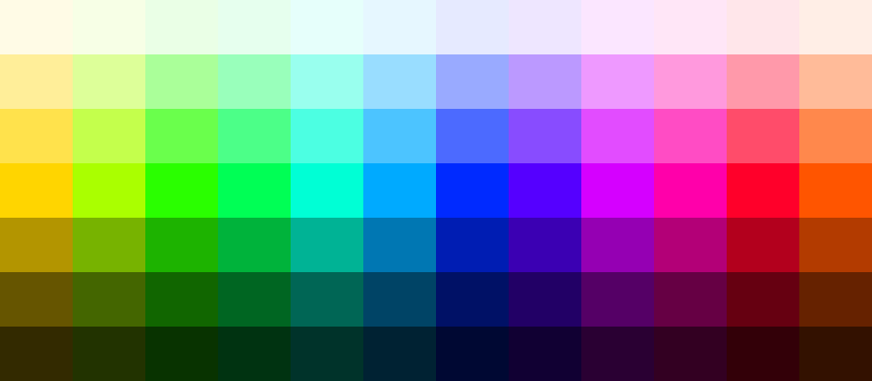

# Tones Generator

This script generates harmonic color palettes with light and dark variants from
a base color using ImageMagick.

## Usage

```bash
./tones-generator.sh <base_color> <number_colors> [number_variants] [block_width]
```

### Arguments

- **base_color**: Starting color (#rrggbb format or color name like 'gold',
  'red', etc.)
- **number_colors**: Number of colors in harmonic palette (2-12)
- **number_variants**: Number of light/dark variants (default: 2, range: 1-10)
- **block_width**: Width of each color block in pixels (default: 80, range:
  10-500)

### Examples

```bash
# Basic usage with hex color
./tones-generator.sh '#ffd700' 12 3

# Using named color with custom block width
./tones-generator.sh 'gold' 12 3 80

# Minimal palette with fewer variants
./tones-generator.sh 'teal' 6 1

# Large palette with many colors
./tones-generator.sh '#3498db' 10 4 100
```

## Sample Palettes

```bash
./tones-generator.sh '#ffd700' 12 3
```


